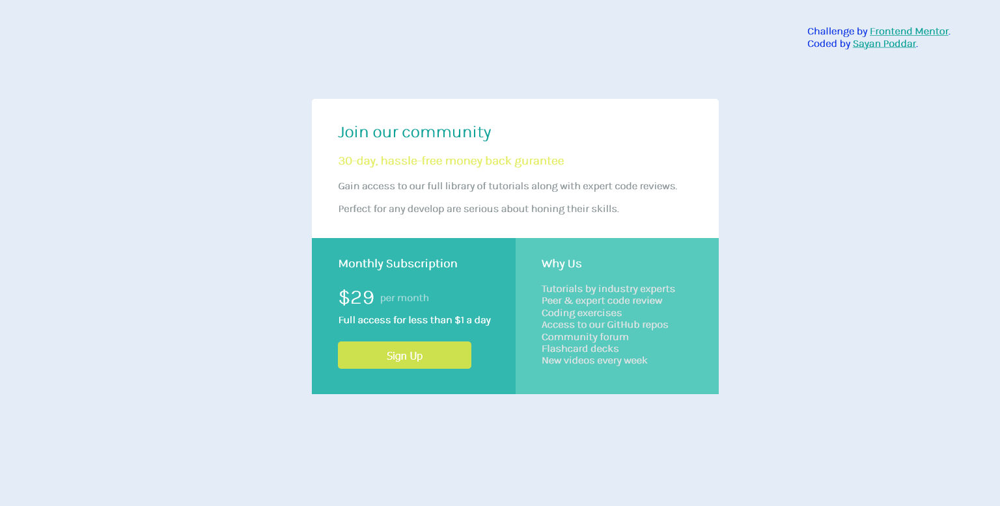

# Frontend Mentor - Single price grid component

## Table of contents

- [Overview](#overview)
  - [The challenge](#the-challenge)
  - [Screenshot](#screenshot)
  - [Links](#links)
- [My process](#my-process)
  - [Built with](#built-with)
  - [What I learned](#what-i-learned)
  - [Continued development](#continued-development)
  - [Useful resources](#useful-resources)
- [Author](#author)

## Overview

### The challenge

Users should be able to:

- View the optimal layout for the component depending on their device's screen size
- See a hover state on desktop for the Sign Up call-to-action

### Screenshot

### Links

- Question URL: [Click Here](https://www.frontendmentor.io/challenges/single-price-grid-component-5ce41129d0ff452fec5abbbc/hub/single-price-grid-component-Zp0EfV9GW)
- Live Site URL: [Add live site URL here](https://your-live-site-url.com)

## My process

### Built with

- Semantic HTML5 markup
- CSS custom properties
- Flexbox
- CSS Grid

### What I learned

I learned how to use Flexbox properly. How to use CSS in a proper way to make good design.

### Continued development

In my upcoming projects I would like to deploy bootstrap and js which will further add responsiveness and several features.

### Useful resources

- [Adobe Color](https://color.adobe.com/create/color-wheel) - This is a very good resource to get a varieties of color . I really liked the color wheel and will use it going forward.
- [Font Awesome](https://fontawesome.com/) - Here we can get several icons, logos which can be used in various places.
- [Google Fonts](https://fonts.google.com/) - A good resource through which we can get different types of fonts.

## Author

- Website - [Add your name here](https://www.your-site.com)
- Frontend Mentor - [@yourusername](https://www.frontendmentor.io/profile/yourusername)
- Twitter - [@yourusername](https://www.twitter.com/yourusername)
